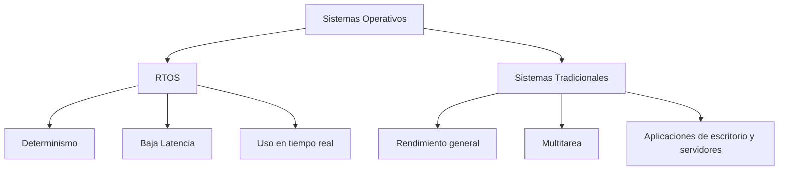

# Sistemas de Tiempo Real (RTOS): FreeRTOS, Zephyr y Diferencias con Sistemas Tradicionales  

## 1. Introducción  

Un **Sistema de Tiempo Real (RTOS, por sus siglas en inglés: Real-Time Operating System)** es un tipo de sistema operativo diseñado para gestionar tareas que requieren un **tiempo de respuesta predecible y garantizado**.  

A diferencia de los **sistemas operativos tradicionales** (como Windows, Linux o macOS), cuyo objetivo principal es **maximizar el rendimiento general y la eficiencia**, los RTOS se enfocan en asegurar que ciertas operaciones críticas se ejecuten en un intervalo de tiempo específico.  

### Importancia de los RTOS  

Los sistemas de tiempo real se aplican en entornos donde el retraso o la falta de respuesta puede generar consecuencias graves. Algunos ejemplos incluyen:  

- 🚗 **Industria automotriz**: control de frenos ABS y bolsas de aire.  
- ✈️ **Aeronáutica**: sistemas de navegación y control de vuelo.  
- 🏥 **Dispositivos médicos**: monitores de signos vitales, marcapasos.  
- 🌐 **Internet de las Cosas (IoT)**: dispositivos pequeños y distribuidos que requieren reacciones rápidas.  

### Características clave  

- **Determinismo**: capacidad de garantizar que las tareas críticas se ejecuten dentro del tiempo esperado.  
- **Baja latencia** en el manejo de interrupciones.  
- **Escalabilidad** para diferentes tipos de hardware.  
- **Consumo eficiente de recursos**, ideal para sistemas embebidos.  

---

## 2. FreeRTOS  

**FreeRTOS** es un RTOS de código abierto ampliamente utilizado en dispositivos embebidos y en aplicaciones de IoT. Fue desarrollado por *Real Time Engineers Ltd.* y actualmente es mantenido por *Amazon Web Services (AWS)*.  

### Ventajas  
- 📌 **Ligereza**: diseñado para microcontroladores con recursos limitados.  
- 📌 **Amplia comunidad y documentación**.  
- 📌 **Integración con AWS IoT Core**, ideal para soluciones en la nube.  
- 📌 **Licencia MIT**, lo que facilita su uso en proyectos comerciales.  

### Limitaciones  
- ❌ Funcionalidades básicas comparado con otros RTOS más complejos.  
- ❌ No está pensado para sistemas grandes con requisitos avanzados de seguridad.  

### Ejemplo de uso  
FreeRTOS es utilizado en:  
- Sensores IoT.  
- Sistemas de automatización en el hogar.  
- Dispositivos portátiles de bajo consumo.  

---

## 3. Zephyr RTOS  

**Zephyr** es un RTOS de código abierto desarrollado inicialmente por *Wind River* y actualmente gestionado por la **Linux Foundation**.  

### Ventajas  
- 📌 **Soporte para múltiples arquitecturas**: ARM, x86, RISC-V, ARC, entre otras.  
- 📌 **Gran ecosistema**: compatible con más de 350 placas de desarrollo.  
- 📌 **Seguridad avanzada**, con enfoque en IoT seguro.  
- 📌 **Modularidad y escalabilidad**, adaptándose desde microcontroladores simples hasta sistemas más potentes.  

### Limitaciones  
- ❌ Curva de aprendizaje más pronunciada que FreeRTOS.  
- ❌ Requiere mayor potencia de hardware en algunas configuraciones.  

### Ejemplo de uso  
Zephyr es utilizado en:  
- Dispositivos médicos conectados.  
- Wearables.  
- Sistemas industriales IoT.  

---

## 4. Diferencias entre RTOS y Sistemas Operativos Tradicionales  

| Aspecto | RTOS (FreeRTOS, Zephyr) | SO Tradicional (Windows, Linux, macOS) |
|---------|--------------------------|----------------------------------------|
| **Objetivo principal** | Determinismo y respuesta en tiempo real | Rendimiento general y multitarea |
| **Planificación** | Basada en prioridades estrictas | Planificación equitativa o justa |
| **Latencia** | Muy baja | Puede variar según carga del sistema |
| **Uso típico** | Automóviles, robots, IoT, satélites | Computadoras personales, servidores |
| **Consumo de recursos** | Muy bajo, apto para microcontroladores | Mayor consumo, requiere hardware potente |
| **Escalabilidad** | Limitada al hardware embebido | Amplia, desde laptops hasta supercomputadoras |

---

## 5. Diagrama Comparativo  

## 6. Conclusión  

Los **Sistemas de Tiempo Real (RTOS)** son fundamentales en aplicaciones críticas donde la **precisión temporal** es indispensable.  

- **FreeRTOS** destaca por su simplicidad, bajo consumo y popularidad en IoT.  
- **Zephyr** se diferencia por su modularidad, seguridad y amplio soporte de hardware.  
- Frente a los **sistemas operativos tradicionales**, los RTOS ofrecen **determinismo, baja latencia y uso eficiente de recursos**, lo que los hace insustituibles en sectores como la industria automotriz, aeroespacial, médica e IoT.  

En conclusión, la elección de un RTOS frente a un sistema operativo convencional depende de la **naturaleza del proyecto**, priorizando la **seguridad, el tiempo de respuesta y la confiabilidad** en entornos críticos.  

---

## 7. Referencias  

- Barry, R. (2021). *Mastering the FreeRTOS Real Time Kernel*. Real Time Engineers Ltd.  
- Zephyr Project. (2023). *Zephyr RTOS Documentation*. The Linux Foundation. Recuperado de: [https://docs.zephyrproject.org](https://docs.zephyrproject.org)  
- Buttazzo, G. (2011). *Hard Real-Time Computing Systems: Predictable Scheduling Algorithms and Applications*. Springer.  
- Tanenbaum, A. S., & Bos, H. (2015). *Modern Operating Systems* (4th ed.). Pearson.  
- AWS. (2023). *FreeRTOS Documentation*. Amazon Web Services. Recuperado de: [https://freertos.org](https://freertos.org)  

